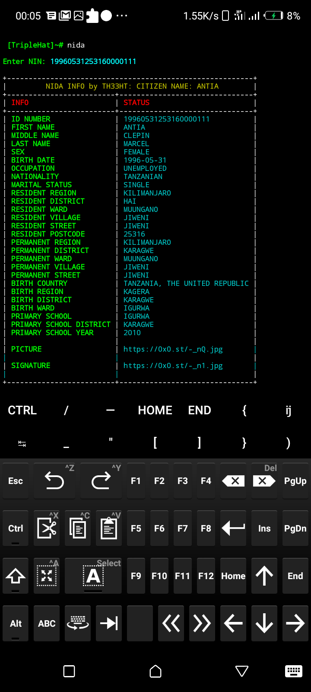

# NIDA

Get User info by NIN

 This Script is coded by <a href="https://github.com/TripleHat">TripleHat</a>, and I get motivated by <a href="https://github.com/kalebu">Kalebu</a>. You may check his Repo here 👉 <a href="https://github.com/Kalebu/Nida">NIDA</a> 

# Installation
Clone this repo or direct download script by wget and make sure you install all needed modules 
 pip install -r requirements.txt
# Get Me
*<a href="https://twitter.com/Triple_Hat">Twitter</a>* 
*<a href="https://github.com/Triple_Hat">GitHub</a>* 
*<a href="https://instagram.com/wh0ami_1">Instagram</a>* 
*<a href="https://TripleHat.github.io">TripleHat_Page</a>* 
## Features
[√] Shows All Info 
[√] Picture and Signature are in forms of link 
[√] Beautiful preview with Table 
# DEMO

## SUPPORTERS

